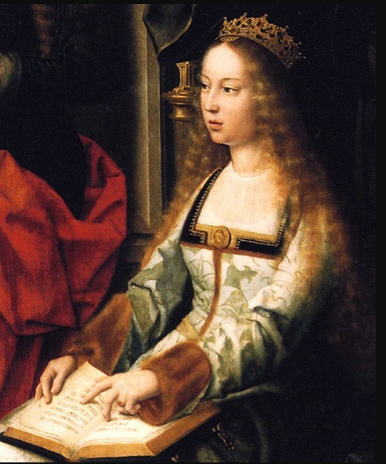
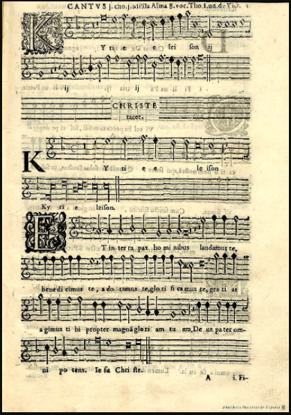
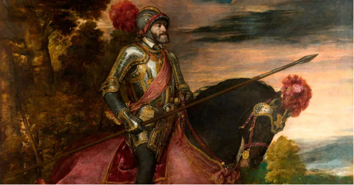
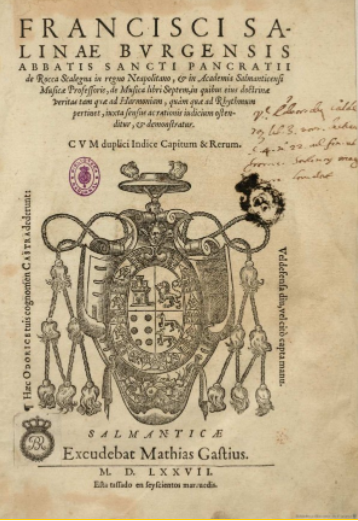

## Contenidos de la presentación

\tableofcontents

# Introducción

## Introducción

-  Un siglo más tarde de la muerte de Alfonso X el Sabio, que había dejado una gran renovación musical en la música española, sube al trono Juan II de Castilla (+1454), quien mantiene una corte de poetas. Su hija, Isabel, se unirá a Fernando II el Católico. 

\vspace{0.2cm}
\centering
{ width=10% }\
\vspace{0.1cm}

### Los Reyes Católicos:

Juntos finalizan la **Reconquista y abren la puerta al Renacimiento.**

## Reyes s. XV y s. SVI

-----------------------------------------------------------------------------------------------
    Siglo XV                                                    Siglo XVI
------------------------                           -------------------------------------------    
  Enrique II (+1406)                                    Juana la Loca y Felipe el Hermoso

  Juan II de Castilla (+1454)                           Carlos V (+1556)

  Isabel de Castilla (+1504)                            Felipe II (+1598)

  y Fernando de Aragón (+1516)                        

------------------------------------------------------------------------------------------------

# Música Española - s. XV -

## Estilo:

"_Las inquietudes renancentistas se manifestaron en España ya a lo largo de toda la segunda mitad del siglo XV, cristalizando en la Gramática de Nebrija publicada en Salamanca en 1481 con el título de *Introductiones latinae* y sobre todo en su **Arte de la lengua castellana** (Salamanca, 1492)._"[^1].

[^1]: QUEROL, Miguel (1971). La polifonía española profana del Renacimiento, Revista Musical Chilena p.30

## Estilo características

::: {.columns}

:::: {.column}

- El estilo característico es la polifonía imitativa:
\vspace{0.2cm}

	1. Distintas voces compartes mismos patrones, 
	2. o comparten mismos motivos melódicos
	3. Y se imitan a modo de fuga
  4. Mezcla de lengua española y latín

::::

:::: {.column}

\centering
{ width=50% }\

::::

:::

## Cancioneros conservados

- Cancionero de Palacio o de Barbieri (1490-1530)
- Cancionero de la Colombina (finales del XV)
- Cancionero de Medinaceli o Cancionero musical de la casa de Medinaceli, de mediados del siglo XVI
- Cancionero de Upsala (1500-1550)

## Principales compositores:

::: {.columns}

:::: {.column}

\vspace{0.6cm}
\centering

1. Juan Cornago
2. Juan de Espinosa
3. Juan del Encina
4. F. de la Torre

::::

:::: {.column}

\vspace{0.6cm}
\centering

5. Juan Ponce
6. Juan del Anchieta
7. Alonso de Alba
8. Pedro Escobar

::::
:::

## Personalidad artística

### Juan del Encina (1468-1529)

Poeta dramaturgo y compositor. Nació cerca de Salamanca y fue miembro de la casa del duque de Alba, director  musical del Papa León X en Roma y, tras ordenarse sacerdote, prior de León.

### Cancionero de Palacio
- La mayor parte de su producción musical conservada la encontramos en el Cancionero de Palacio (69 villancicos y romances)

## El villancico

### Descripción:
- Se trata de un **género polifónico de carácter profano** surgido en España a finales del siglo XV. También recibe el mismo nombre una **canción religiosa popular** que se canta en Navidad.

\vspace{0.2cm}

### Métrica:
Por lo general, se trata de una canción estrófica en la que todos los versos tienen la misma música. Consta de un estrilla que alterna con estrofas octosílabas, aunque ritmo y rima son variables.

# Música Española - s. XVI -

## Generalidades:
- El Siglo de Oro comprende los reinados del emperador Carlos V y el rey Felipe II.
- Es el siglo de Cervantes, Lope de Vega, el Greco...

### En música:
- Es el siglo de la gran polifonía sacra y de la música de vihuela

## Carlos V

::: {.columns}

:::: {.column}

\vspace{0.6cm}
\centering

- El emperador trajo a España su **capilla flamenca**, que tocaría en actos religiosos. La **capilla española** de los Reyes Católicos continuaba tocando en festividades profanas, música instrumental y baile folclórico.

::::
:::: {.column}

\centering
{ width=80% }\
::::
:::

## Principales compositores

    Escuela castellana        Escuela andaluza                    Escuela catalana
------------------------    ------------------------          ----------------------------
 Tomás Luis de Victoria        Francisco Guerrero                  Mateo Flecha el viejo
 Antonio de Cabezón            Juan Navarro                        Juan Budrieu
 Francisco Salinas             Juan Vázquez                        Juan Pablo Pujol

## Antonio de Cabezón

### El Bach español
- Fue considerado el mejor instrumentista de su tiempo. Ciego desde la infancia, perteneció a la Capilla Real como organista y clavecinista.

### Tientos, glosas y diferencias
- con este nombre se conocen las obras precursoras de la fuga y la tocata, basados en la imitación, que inventó Cabezón.

## Tratados musicales

### Tratadistas teóricos
- El siglo XVI conoce una eclosión de teoría musical

\centering
{ width=20% }\

## Tratadistas musicales

1. Francisco Salinas (*De musica libri septem*)
2. Francisco de Montanos (*Arte de música, theórica y práctica*)
3. Diego Ortiz (*Trattado de glosas*)

# Referencias

## Referencias:

- QUEROL, Miguel (1971). La polifonía española profana del Renacimiento, Revista Musical Chilena
- HISPANOTECA<http://www.hispanoteca.eu/M%C3%BAsica%20ES/8-M%C3%BAsica%20espa%C3%B1ola%20del%20Renacimiento.htm>
